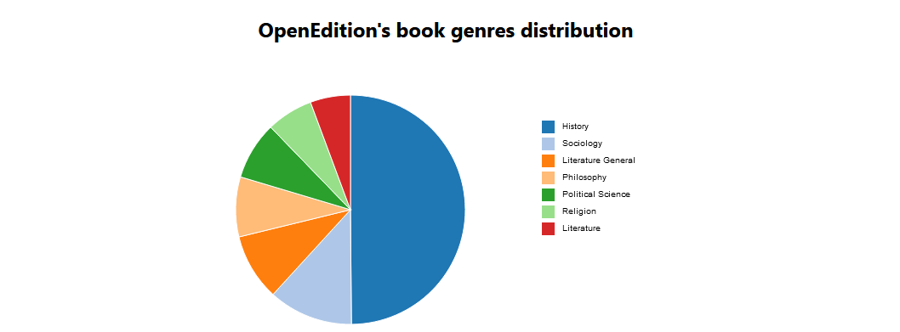

# OpenEdition Explorer

Exploration and visualization of the OpenEdition dataset.

To start the application, load the [data](https://drive.google.com/file/d/1g_ydUlaoqp4M1NU-aCCSqwC8SlRvqXaY/view?usp=share_link) on Apache Fuseki on port 3030, and simply double click on the html file to open it in your browser.

## Visualizations
### Number of authors
The following visualization allows the filtering of books in the OpenEdition dataset based on the minimum number of authors they must have. The titles having to be trimmed for space reasons, clicking on a book displays the title of the book as well as the number of authors it has under the chart.

### Authors by birth month
The following visualization matches authors present in OpenEdition and wikidata in order to get the authors' birth month. A bar chart is then used to show their distribution among the data.

### Authors by birth month
The following visualization shows the distribution of genres among books in the OpenEdition dataset.
